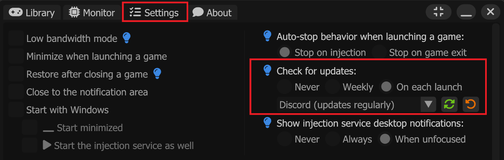
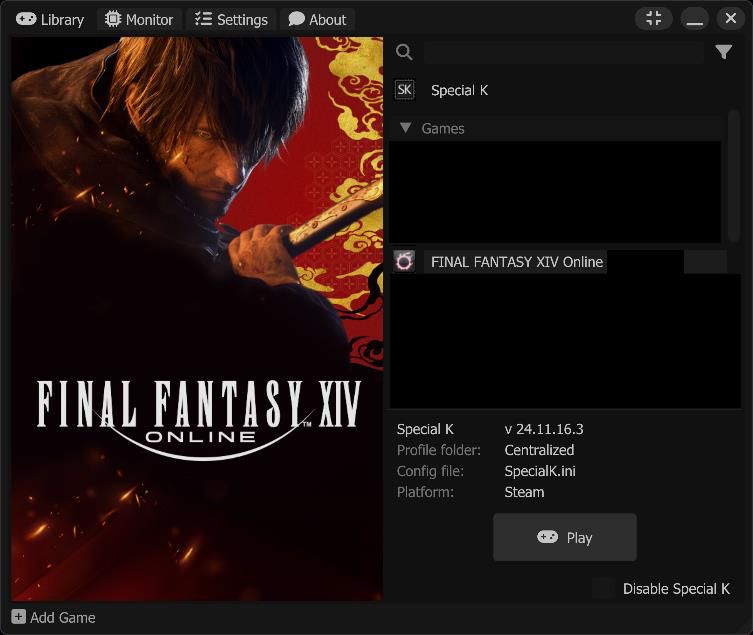
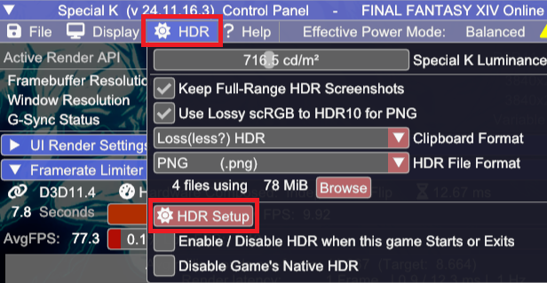
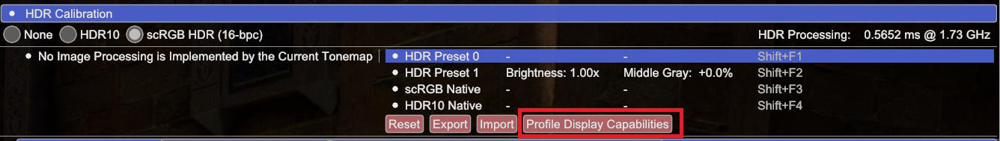
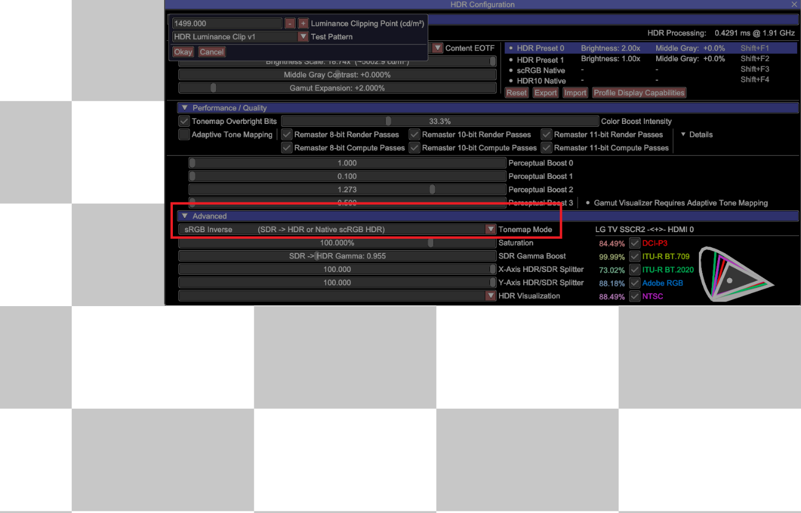
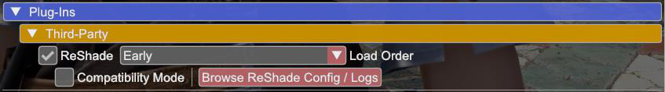
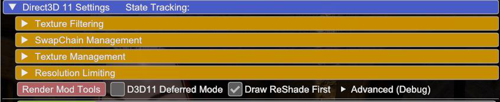
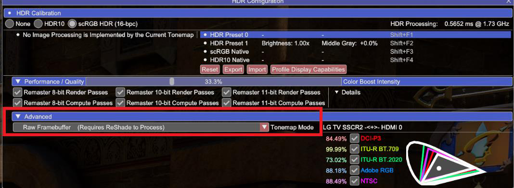
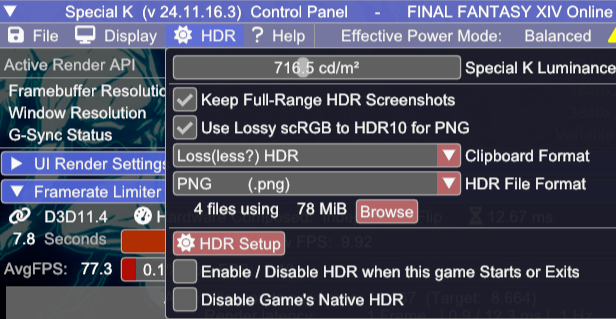

## Guides are a work in progress and will be updated over time

### PDF versions of guides can be found [here](https://github.com/CreepySasquatch/reshade-guides)

* * *

 

How to setup HDR with ReShade

###Using Special K with Lilium's Inverse Tone Mapping

**WARNING: DO NOT USE WITH RenoDX!!!** 
> RenoDX does not work with RTGI or other shaders that don't play well with HDR.

**This guide is currently only tested with DirectX 11 games.**

**If the game supports HDR, make sure HDR is turned off within the game's settings before continuing.**

> The purpose of this guide is to help you get HDR working with ReShade shaders that don't like HDR, such as RTGI. 
>
> Some games may require additional steps. Use with other mods or tools not supported.

> **Note: Otis' Camera Tools are generally not compatible with SpecialK. Use Lilium's fork of DXVK or Lilium's AutoHDR addon instead. 
> These methods are currently not covered in this guide but may be added in the future.

**1. Download the latest version of the Special K installer from the Special K Discord and install Special K**
- [Special K Discord Invite](https://discord.gg/SpecialK)

- Installer will be found under the installers channel

- **OPTIONAL: Configure SK so it auto updates anytime a new installer is posted on the SK Discord**

**2. Launch the game from the SK Launcher by clicking on it, then click Play.**

**3. You should see the Special K bar on top of your screen when the game launches. 

**4. Press Ctrl + Shift + Backspace to open the Special K menu**

**5. Click HDR > HDR Setup > Click the Radial next to scRGB**

**6. Press Alt + Enter a few times to activate HDR. If this doesn't work, exit the game and restart it from the Special K launcher again.**

 

Special K HDR Calibration

> If you have already calibrated HDR within SpecialK continue onto Step 7.

**A. Open the SK menu > HDR > HDR Setup**

**B. Click on Profile Display Capabilities to calibrate Special K to your monitor.**

**C. Make sure sRGB Inverse is selected under Advanced, otherwise the test pattern won't show up.** 
- After your display is calibrated, you won't need to do this step ever again in Special K unless you get a new monitor.

**7. Open the SK menu > HDR > HDR Setup**

> **11.Exit the HDR Configuration menu of SK but keep the SK main menu
> open**\
> **12.Toward the buttom of the SK menu click on Plug-Ins \>
> Third-Party**\
> **13.Check the box next to *ReShade* and make sure *Early* is selected
> in the Load Order drop** **down. Un-Check the box next to
> Compatibility mode.**
>
> {width="4.043055555555555in"
> height="0.5625in"}
>
> **14.Close out of the SK menu and exit the game.**
>
> **15.Download Reshade with Full Addon Support from d 16.Extract the
> ReShade64.dll file from the ReShade_Setup_6.X.X_Addon.exe using**
> **WinZip, 7Zip, WinRar, etc.**
>
> **17.Copy the ReShade64.dll you extracted and paste it into the
> Special K\\**\
> **Plugins\\ThirdParty\\ReShade folder wherever you installed Special
> K. If you installed** **to the default location on the C: Drive then
> it should be located in *C:\\Program *** ***Files\\Special
> K\\PlugIns\\ThirdParty\\ReShade***\
> •**It's likely the current addon version of ReShade is already located
> here but it** **never hurts to redo this process and it's a good habit
> to get into anytime there's** **a ReShade update.**
>
> **18.Grab the latest version of EndlessFlowering's \\ Lilium's HDR
> shaders at**\
> \
> **19.Place the Shaders and Textures into the S*pecial
> K\\Profiles\\GAME\\ReShade\\Shaders *** **and *Special
> K\\Profiles\\GAME\\ReShade\\Textures* respectively**\
> **20.Place any other ReShade Addons, Shaders, and Textures into their
> respective folders** **within Special K\\Profiles\\GAME\\ReShade\\**\
> •**Presets can go into this ReShade folder as well.**
>
> •**DO NOT USE RenoDX with this as it will not work with Special K or
> any ReShade shaders that hate HDR like RTGI. If the addon is present
> when you start the game, please disable RenoDX under the AddOns tab of
> ReShade.**
>
> **21.Start the game from the Special K launcher.**
>
> **22.Make sure both ReShade and Special K load. If not go through all
> the previous steps to make sure you didn't miss anything. Also,
> doublecheck to make sure ReShade compatibility mode is still not
> checked.**
>
> **23.If everything worked as planned you should see Draw ReShade First
> is checked under** **Direct3D 11 Settings within the Special K menu.**
>
> {width="5.345833333333333in"
> height="1.0986111111111112in"}
>
> **24.Once you're at the main menu of the game, open the SK menu and go
> to HDR \> HDR** **Setup**
>
> **25.Under Advanced change Tonemap Mode to Raw Framebuffer. Your
> screen will look** **weird after this but that's normal. The next
> steps will fix this.**
>
> {width="4.836111111111111in"
> height="1.7763888888888888in"}
>
> **26.Open the ReShade menu.**
>
> **27.Search for *Lilium's inverse tone mapping* and activate it. Make
> sure that it is after all non-HDR ReShade Shaders (the ones that need
> tone-mapped into HDR). If you place it below all other shaders it
> should be fine.**
>
> **28.Within the settings of lilium_inverse_tone_mapping.fx edit the
> following settings:**•**Inverse tone mapping method: BT.2446 Method
> A**\
> •**Input gamma: 2.2**\
> •**Overbright bits handling: Filmic roll off (S-curve)**\
> •**Target Brightness: Set to the peak brightness value of your
> display**\
> •**Processing mode: Luminance (looks more natural)**\
> •**Input white point: 203 nits**\
> •**Max input brightness: 203 nits**

**Feel free to mess around with the settings in step 31 to better suit
your monitor. You can also use Pumbo's AdvancedAutoHDR.fx shader or SK's
built-in inverse tone mapping instead of either shader.**

**You can take HDR PNG screenshots with SK by pressing the F9 key. By
default, these will go into the *Special
K\\Profiles\\GAME\\Screenshots\\HDR* folder. The screenshot settings can
be adjusted within the in-game SK HDR menu**

{width="3.5805555555555557in"
height="1.8541666666666667in"}

**HDR PNG screenshots will auto tone map into SDR for anyone with an SDR
monitor and is the only way to share HDR screenshots in Discord. Make
sure hardware acceleration is enabled within the Discord settings.
Otherwise, you'll have to open the screenshot in a web browser to see
the full image quality.**

**Written by CreepySasquatch.**

